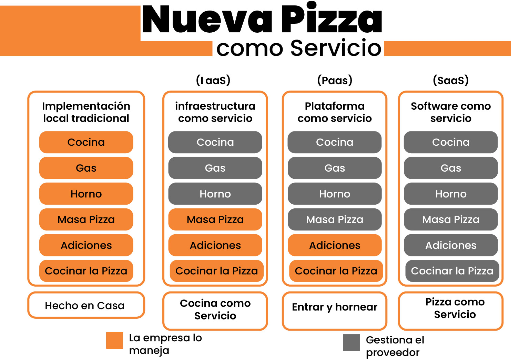

# ☁️ Virtualización y Cloud Computing

Este tema cubre la infraestructura: el lugar físico o virtual donde se ejecuta nuestro software. Entender la evolución desde los servidores físicos hasta la nube es clave para entender por qué usamos herramientas modernas.

DevOps significa que los desarrolladores entienden la infraestructura y los administradores de sistemas entienden el ciclo de desarrollo
---

## 1. Evolución de la Infraestructura

### 🖥️ 1. Bare Metal (On-Premise / Tradicional)
Es el modelo clásico. La empresa compra sus propios servidores físicos, los instala en un rack en su oficina o centro de datos (CPD).
* **Responsabilidad:** Tú gestionas TODO (electricidad, refrigeración, cables, hardware, SO).
* **Problema:** Es caro (CapEx), lento de escalar y si el hardware falla, es tu problema.

### 📦 2. Virtualización
Gracias a un software llamado **Hipervisor** (como VMware, KVM o VirtualBox), podemos dividir un servidor físico potente en muchas "Máquinas Virtuales" (VMs).
* **Ventaja:** Aprovechamiento total del hardware (no tienes un servidor gigante para una app pequeña).
* **Aislamiento:** Cada VM tiene su propio Sistema Operativo completo.

### 🌐 3. Cloud Computing (La Nube)
La definición simplificada: *"La nube es simplemente el ordenador de otra persona"*.
Proveedores (AWS, Azure, Google Cloud) gestionan centros de datos gigantes y te alquilan recursos por uso.
* **Cambio de mentalidad:** Pasamos de comprar hardware a alquilar servicios.

---

## 2. Modelos de Servicio en la Nube (La Analogía de la Pizza 🍕)

Dependiendo de cuánto gestionas tú (color naranja) y cuánto gestiona el proveedor (color gris), existen tres modelos principales.

### 🏗️ IaaS (Infraestructura como Servicio)
* **Concepto:** Te alquilan el hardware virtual (CPU, RAM, Red). Tú instalas el sistema operativo y el software.
* **En la imagen (Cocina como servicio):** El proveedor pone la infraestructura (cocina, gas, horno). Tú traes la masa, los ingredientes y cocinas la pizza.
* **Ejemplo:** Amazon EC2, Google Compute Engine, Máquinas Virtuales de Azure.

### 🛠️ PaaS (Plataforma como Servicio)
* **Concepto:** Te dan el entorno listo para ejecutar código. No te preocupas del Sistema Operativo ni de parches de seguridad. Solo subes tu código.
* **En la imagen (Entrar y hornear):** El proveedor pone casi todo. Tú solo traes la pizza (tu código/datos) y la horneas.
* **Ejemplo:** Heroku, Google App Engine, AWS Elastic Beanstalk.

### 📦 SaaS (Software como Servicio)
* **Concepto:** Usas el software directamente como usuario final. No ves nada de lo que hay detrás, ni código ni servidores.
* **En la imagen (Pizza como servicio):** Vas a un restaurante. Te sientas y comes. Todo está gestionado por el proveedor.
* **Ejemplo:** Gmail, Dropbox, Salesforce, Netflix.

---

## 3. Concepto DevOps Clave: Pets vs Cattle 🐮

Esta es la filosofía más importante sobre infraestructura en DevOps. Marca la diferencia entre un SysAdmin tradicional y un ingeniero DevOps moderno.

### 🐶 Pets (Mascotas) - Modelo Antiguo
Tratamos a los servidores como mascotas.
* **Tienen nombre propio:** (ej: *Servidor-Zeus*, *DB-Principal*).
* **Son únicos:** Si se "enferman" (fallan), los cuidamos: entramos por SSH, reiniciamos servicios, investigamos logs manualmente.
* **Problema:** Es un proceso manual, lento y difícil de reproducir.

### 🐮 Cattle (Ganado) - Modelo DevOps
Tratamos a los servidores como ganado.
* **Tienen números:** (ej: *web-worker-01*, *web-worker-02*).
* **Son desechables:** Son idénticos entre sí (creados desde una plantilla automatizada).
* **Solución:** **Si se enferman, no los curamos.** Los eliminamos y creamos uno nuevo automáticamente en segundos.
* **Beneficio:** Permite la **Inmutabilidad** y la **Escalabilidad** masiva.

---

## 4. Tipos de Despliegue en Nube

* **Pública:** Recursos compartidos en proveedores públicos (AWS, Azure). Más barata y elástica.
* **Privada:** Infraestructura dedicada exclusivamente para una empresa. Más control y seguridad, pero más cara.
* **Híbrida:** Una mezcla conectada. (Ej: Datos sensibles en servidores privados, pero la web pública en AWS para aguantar picos de tráfico).