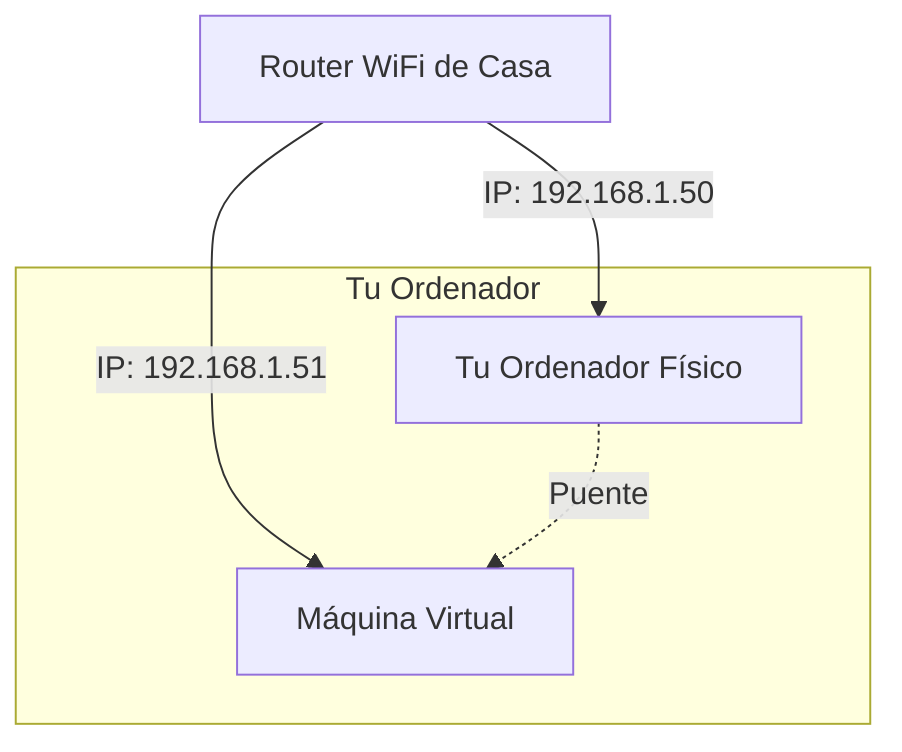

# 🛠️ Creación Manual de Máquinas Virtuales

En esta sección crearemos dos servidores Linux (CentOS y Ubuntu) paso a paso. Aunque el objetivo final del curso es automatizar esto con Vagrant, aprender a hacerlo manualmente es vital para entender cómo se configuran el hardware virtual, las particiones y las redes.

---

## 🛑 Prerrequisitos Críticos (Solo Windows)
Si usas Windows, **DEBES** realizar estos dos pasos antes de abrir VirtualBox o fallará.

### 1. Activar Virtualización en BIOS
Debes entrar a la BIOS/UEFI de tu ordenador (F2, F12, Del o Esc al arrancar) y activar la tecnología de virtualización.
* **Intel:** Busca `Intel Virtualization Technology` o `VT-x`.
* **AMD:** Busca `SVM Mode` o `AMD-V`.
* **Estado:** Debe estar en **ENABLED**.

### 2. Desactivar Hyper-V y Conflictos
VirtualBox odia compartir el control con Windows. Busca **"Activar o desactivar las características de Windows"** en el menú Inicio y **DESMARCA** (Disable) las siguientes casillas:
* ❌ Microsoft Hyper-V
* ❌ Plataforma de Hipervisor de Windows (Windows Hypervisor Platform)
* ❌ Plataforma de máquina virtual (Virtual Machine Platform)
* ❌ Subsistema de Windows para Linux (WSL)
* ❌ Docker Desktop (si aparece como feature)

> **Reinicia tu ordenador** después de aplicar estos cambios.

---

## 📥 Descarga de ISOs
Necesitamos los discos de instalación de los sistemas operativos. Descarga estos archivos `.iso`:

| Sistema Operativo | Versión Exacta a Buscar | Link / Notas |
| :--- | :--- | :--- |
| **CentOS Stream 9** | `CentOS Stream 9` -> `x86_64` -> **`boot.iso`** | [Web Oficial](https://www.centos.org/download/) (Aprox 1GB) |
| **Ubuntu Server** | `Ubuntu Server 22.04 LTS` | [Web Oficial](https://ubuntu.com/download/server) (No descargar versión Desktop) |

---

## 🌐 Concepto Clave: Bridged Networking (Adaptador Puente)
Para que nuestras VMs se comporten como servidores reales en tu casa, usaremos el modo **"Adaptador Puente"**.

1.  **NAT (Adapter 1):** Permite a la VM tener internet (salir fuera).
2.  **Bridged (Adapter 2):** Conecta la VM directamente a tu Router WiFi a través de la tarjeta de red de tu PC.
    * Tu Router le asignará una IP real (ej: `192.168.1.51`) distinta a la de tu PC.
    * Esto permite conectar por SSH desde tu terminal local fácilmente.

👉 **Siguiente paso:** Ve a la guía de [Instalación de CentOS](./guide-centos.md).